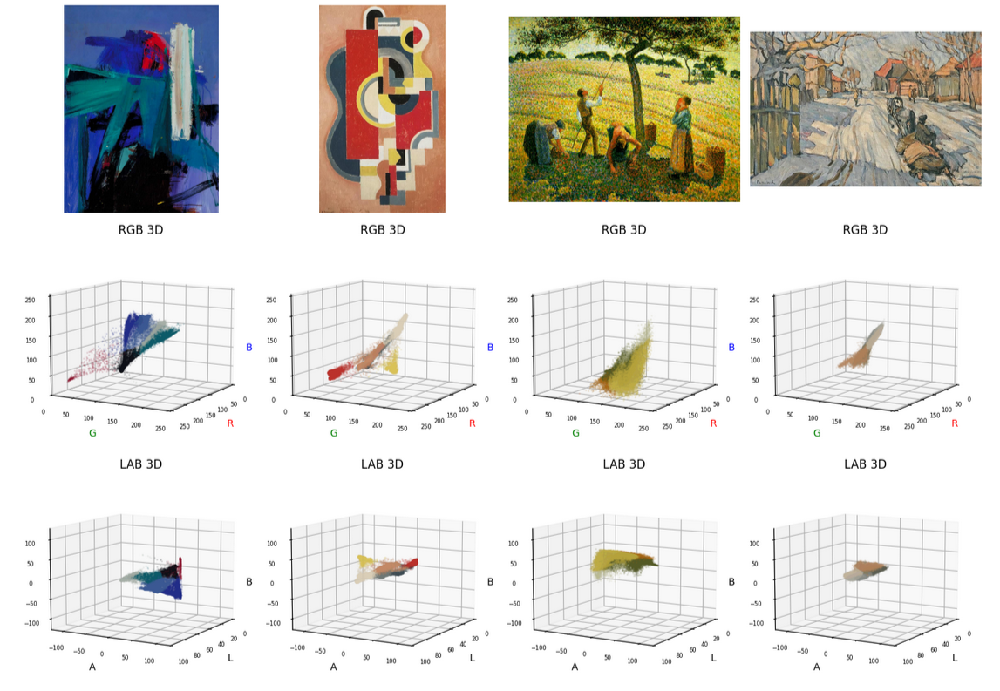
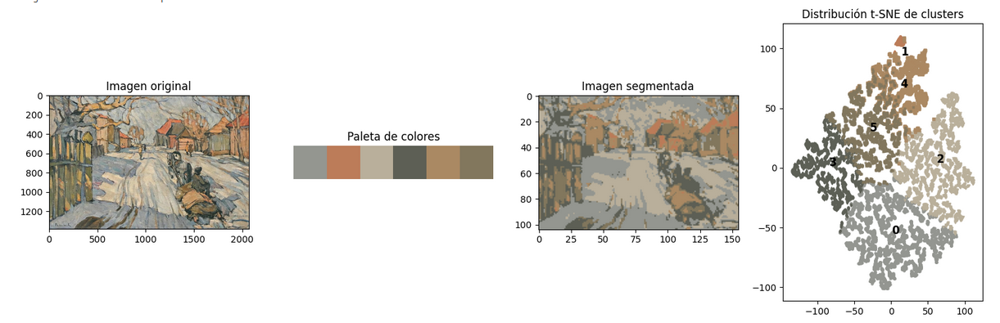
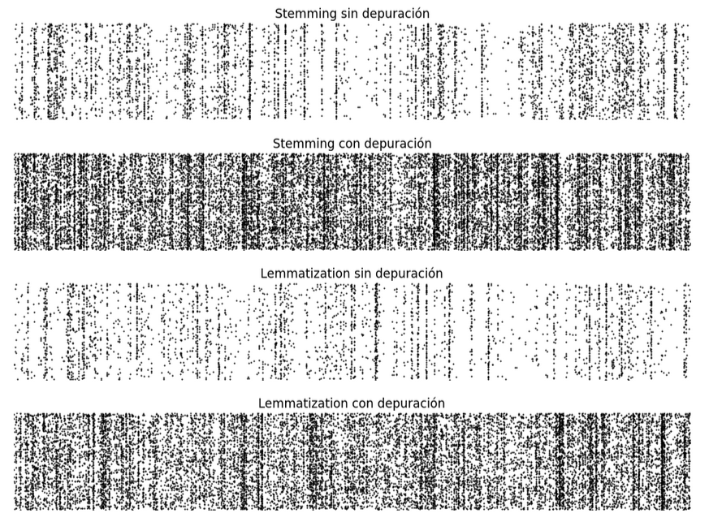
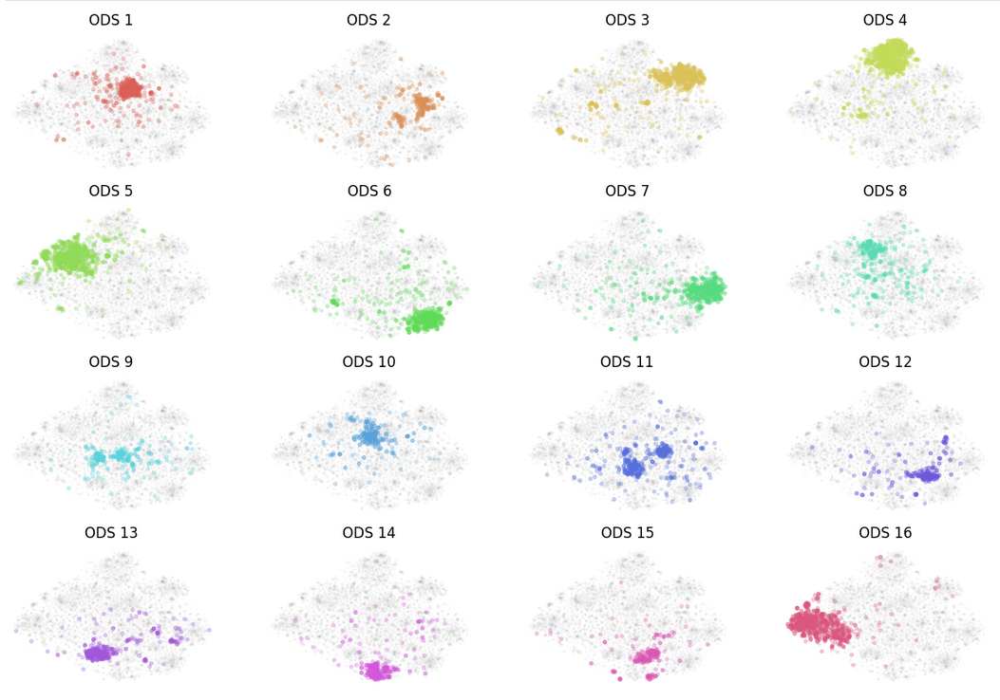
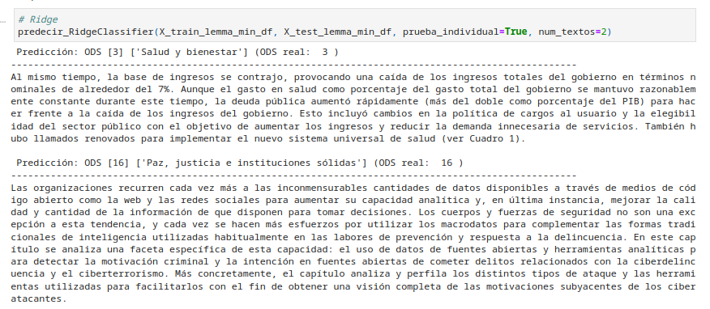

# MAIA-UL
## Micro-Proyectos
### **Micro-Proyecto 1:** 

Generación de paleta de colores a partir de imágenes [Wikiart](https://www.kaggle.com/datasets/steubk/wikiart) mediante algoritmos de agrupación.

---

---

### **Micro-Proyecto 2:**

Impacto del preprocesamiento en la clasificación de textos: [Objetivos de Desarrollo Sostenible](https://zenodo.org/records/5550238).

---

---

---

